# Diabetic Retinopathy Stage Detection Using Transfer Learning

**Module:** Computer Vision — Coursework
**Student:** Pradeesha Hettiarachchi
**Code:** https://github.com/pradeesha999/dr-stage-detection-v2
**Demo video:** _[URL to be added]_

---

## Abstract

Diabetic retinopathy (DR) is the leading cause of preventable blindness in working-age adults, yet it is asymptomatic until late and is diagnosed by manual grading of retinal fundus photographs. This coursework builds an end-to-end pipeline that classifies a fundus image into the five International Clinical DR severity stages. Using the Kaggle 2015 DR dataset (35,126 images, 17,563 patients), the pipeline applies a reproducible preprocessing chain (border crop, CLAHE, denoising, unsharp masking), retina-safe augmentation, class-imbalance handling, and two-phase transfer learning with an ImageNet-pretrained CNN. Model choice, balancing strategy and hyper-parameters were selected by controlled experiments on a patient-level validation split, and the final model was evaluated once on a held-out test set with accuracy, precision, recall, F1, quadratic-weighted kappa, ROC/PR curves, confusion matrices, error analysis and Grad-CAM visualisations. A Gradio prototype demonstrates inference with visual explanations. _[Headline test results to be inserted.]_

---

## 1. Introduction and Problem Understanding

### 1.1 Diabetic retinopathy and why automated grading matters

Diabetic retinopathy is a microvascular complication of diabetes in which chronically elevated blood glucose damages the retinal capillaries. Roughly one third of people with diabetes show some degree of DR, and about 10 % have a vision-threatening form [1]. The disease progresses silently: the patient notices nothing until macular oedema or a vitreous haemorrhage causes sudden vision loss. Early detection through annual fundus photography and timely laser or anti-VEGF treatment prevents most of this blindness, which is why national screening programmes exist.

Screening is a bottleneck. Every image must be graded by a trained reader, grading is subjective at the boundaries between stages, and the number of people with diabetes is rising far faster than the number of graders. Gulshan et al. [2] showed in 2016 that a deep convolutional network can match ophthalmologist-level sensitivity and specificity for referable DR, which triggered wide interest in automated grading. This coursework reproduces the essential components of such a system at a scale that fits a single GPU.

### 1.2 The five-stage severity scale

Graders use the International Clinical Diabetic Retinopathy (ICDR) scale [3], which the Kaggle 2015 dataset labels 0–4:

| Stage | Name | Retinal findings |
|---|---|---|
| 0 | No DR | No abnormalities |
| 1 | Mild NPDR | Microaneurysms only (tiny red dots, ~20–100 µm) |
| 2 | Moderate NPDR | Microaneurysms plus dot/blot haemorrhages, hard exudates (yellow lipid deposits), cotton-wool spots |
| 3 | Severe NPDR | >20 haemorrhages in each quadrant, venous beading, intraretinal microvascular abnormalities (IRMA) |
| 4 | Proliferative DR | Neovascularisation, vitreous / pre-retinal haemorrhage, fibrous proliferation |

Two properties of this scale shape the whole design. First, it is **ordinal**: predicting Moderate for a Severe eye is a smaller error than predicting No DR, so an ordinal-aware metric (quadratic-weighted kappa) is used alongside accuracy and F1. Second, the lesions that separate stages are **small and low-contrast**: a microaneurysm may be 2–3 pixels wide in a 224-pixel image, which motivates contrast and edge enhancement in preprocessing and forbids augmentations that distort lesion shape or colour.

### 1.3 Task formulation

Given a colour fundus photograph, predict its ICDR stage (5-class classification) using a CNN with transfer learning. Deliverables are a commented codebase, this report, and a recorded prototype. The work maps onto the module learning outcomes as follows:

| LO | Where addressed |
|---|---|
| LO1 – suitability of image models and representations | §2 (RGB fundus images, LAB colour space for CLAHE), §4 (ImageNet feature representations) |
| LO2 – acquisition, display and transmission technologies | §2.3 (fundus cameras, illumination variability), §8 (deployment) |
| LO3 – filtering, segmentation, feature extraction algorithms | §3 (CLAHE, Gaussian filtering, unsharp masking, border segmentation) |
| LO4 – object and pattern recognition techniques | §4–§6 (CNN architectures, transfer learning, evaluation, Grad-CAM) |

---

## 2. Dataset

### 2.1 Source and structure

The data is the *Diabetic Retinopathy 2015 Data Colored Resized* dataset on Kaggle [4], a 224×224 resized version of the EyePACS training set from the 2015 Kaggle DR competition [5]. It contains **35,126 PNG images** organised in five class folders plus `trainLabels.csv`. Each file is named `<patient>_<left|right>`, so the set covers **17,563 patients with both eyes imaged**. Folder labels were cross-checked against the CSV: zero mismatches (notebook `01_eda`).

### 2.2 Class distribution

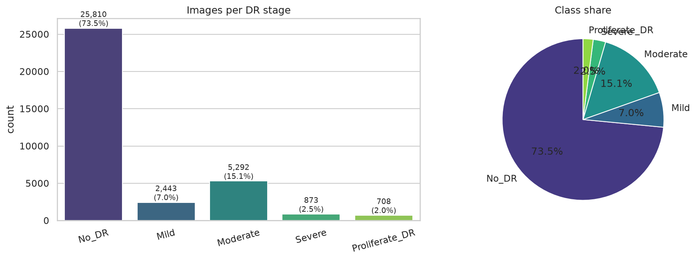
*Figure 1 – Images per DR stage. 73.5 % of images are No DR; Proliferative DR is 2.0 %.*

| Stage | Images | Share |
|---|---|---|
| No DR | 25,810 | 73.5 % |
| Mild | 2,443 | 7.0 % |
| Moderate | 5,292 | 15.1 % |
| Severe | 873 | 2.5 % |
| Proliferative DR | 708 | 2.0 % |

The **imbalance ratio is 36.5 : 1**. A classifier that always answers "No DR" would score 73.5 % accuracy while being clinically useless; therefore accuracy is reported but never used for model selection, and §4 dedicates an experiment to imbalance handling.

### 2.3 Image characteristics

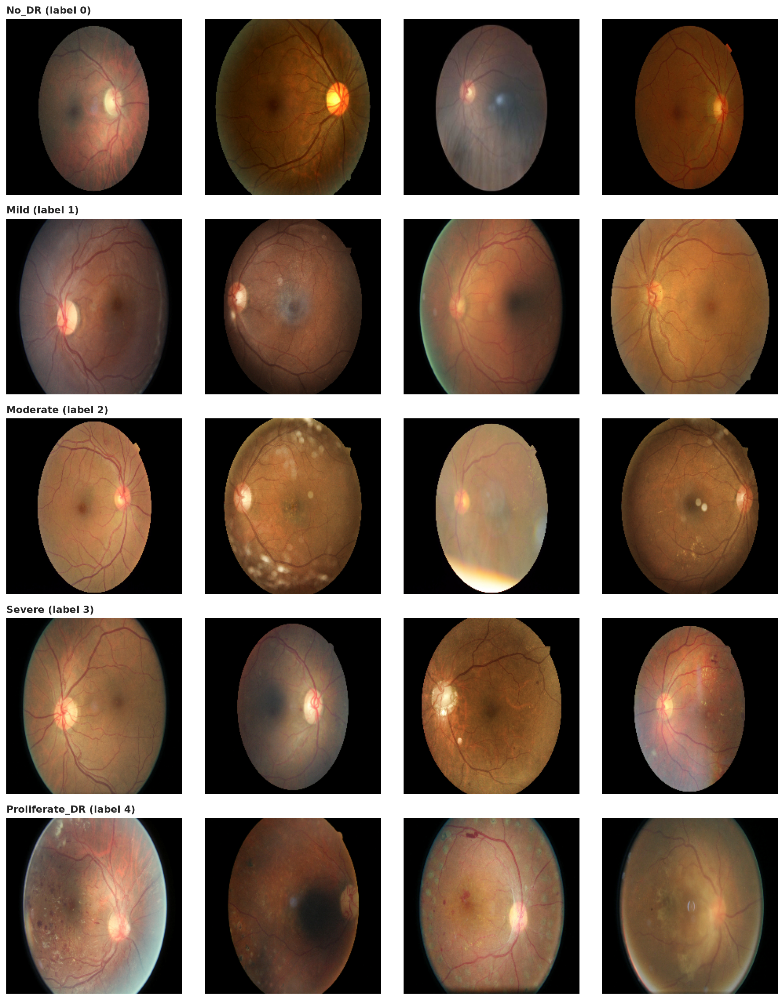
*Figure 2 – Four random images per stage. Note the large variation in exposure and colour cast between cameras, and how small the stage-defining lesions are.*

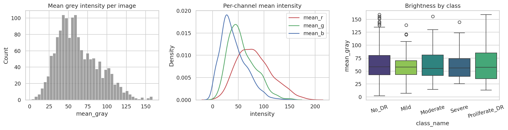
*Figure 3 – Brightness distribution across 1,500 sampled images; per-channel intensity; brightness by class.*

All images are 224×224 px. Mean grey level ranges from about 5 (almost black scans) to 160, and the red channel dominates, as expected for fundus photography where the green channel carries most vessel/lesion contrast. This variability originates from the acquisition side (LO2): EyePACS images were captured on many camera models under different flash settings and pupil dilation, then JPEG-compressed and resized. The black frame around the circular retina occupies roughly 20–30 % of each frame.

### 2.4 Patient-level structure and the split

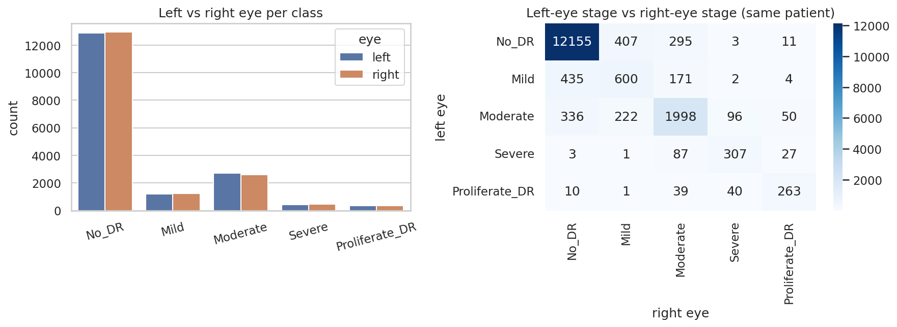
*Figure 4 – Left-eye vs right-eye stage for the same patient: 87.2 % of patients have both eyes at the same stage.*

Because both eyes of a patient share vasculature, camera and usually disease stage, a random image-level split would place one eye in the training set and its twin in the test set — the model could partially memorise the patient and every metric would be inflated (data leakage). The split was therefore performed **at patient level**: patients were stratified by the maximum stage of their two eyes and divided 70/15/15 into training, validation and test sets, with assertions guaranteeing that no patient ID appears in two sets.

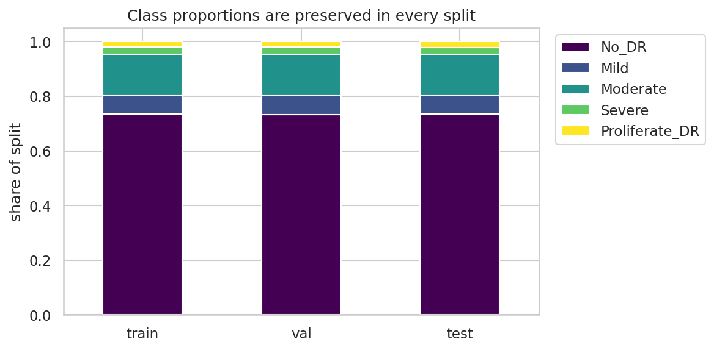
*Figure 5 – Class proportions are preserved in every split.*

| Split | Images | Patients | No DR | Mild | Moderate | Severe | PDR |
|---|---|---|---|---|---|---|---|
| Train | 24,588 | 12,294 | 18,070 | 1,708 | 3,704 | 611 | 495 |
| Validation | 5,268 | 2,634 | 3,868 | 369 | 795 | 131 | 105 |
| Test | 5,270 | 2,635 | 3,872 | 366 | 793 | 131 | 108 |

The validation set is used for every modelling decision (§4); the test set is evaluated exactly once (§5).

### 2.5 Limitations and ethical considerations

* **Label noise.** Each EyePACS image was graded by a single clinician; inter-grader agreement at the Mild/Moderate boundary is known to be modest, which caps achievable accuracy.
* **Resolution.** Downsampling to 224 px destroys the smallest microaneurysms, making Mild the hardest stage.
* **Domain.** Images come from US screening clinics; performance on other populations, cameras or ethnicities is not guaranteed (dataset shift).
* **Privacy.** The dataset is de-identified (numeric IDs only) and released under Kaggle's competition licence; no attempt is made to re-identify patients.
* **Clinical role.** The model is a screening aid that prioritises referral, not a diagnostic device; false negatives on Severe/PDR carry the highest cost, which informs the referable-DR analysis in §5.

---

## 3. Image Preprocessing

### 3.1 Pipeline

Every image passes through the same deterministic chain, implemented in `src/preprocess.py` and cached to disk once so that training epochs pay only for augmentation:

```
raw RGB → crop black border → pad to square, resize 224 → CLAHE (LAB L-channel)
        → 3×3 Gaussian denoise → unsharp mask (σ = 3, amount = 1.5) → uint8 RGB
```

Mean/standard-deviation normalisation is deliberately **not** part of this chain; it is applied inside the Keras model by the backbone's own normalisation layer so that it always matches the ImageNet statistics of the pretrained weights and the saved model is self-contained at inference time.

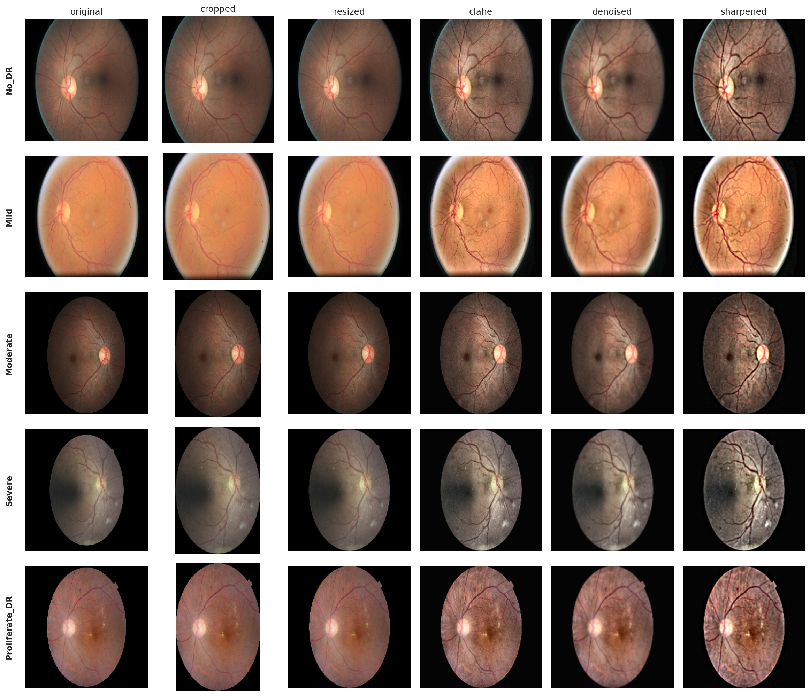
*Figure 6 – Each step of the pipeline on one image per stage.*

### 3.2 Justification of each step (LO3)

| Step | Algorithm | Why |
|---|---|---|
| Border crop | Threshold grey > 7, keep bounding box of foreground (simple intensity segmentation) | Removes the uninformative black frame so the retina fills the CNN's receptive field; recovers ~20–30 % of pixels. |
| Pad + resize | Zero-pad to square, area/cubic interpolation | Fixed input size without distorting the circular retina. |
| CLAHE | Contrast-Limited Adaptive Histogram Equalisation [6] on the L channel of LAB, 8×8 tiles, clip limit 2.0 | Equalises the wide exposure range seen in Figure 3 *locally*, so dark peripheries and bright discs are both readable; operating on L preserves the colour of lesions. The clip limit prevents noise amplification in flat regions. |
| Denoise | 3×3 Gaussian filter | Suppresses sensor noise that CLAHE amplifies. The kernel is deliberately small: a median or larger Gaussian would erase 2–3-pixel microaneurysms. |
| Edge enhancement | Unsharp masking: `out = img + 1.5·(img − G_σ=3(img))` | Sharpens vessel walls, exudate edges and haemorrhage boundaries — the features that separate stages. |

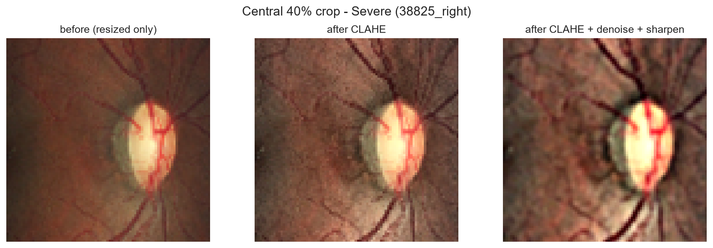
*Figure 7 – Central 40 % of a Severe image before and after enhancement: exudates and haemorrhages become distinct.*

### 3.3 Comparison with Ben Graham normalisation

Ben Graham's winning 2015 method [7] subtracts a heavy Gaussian blur (`4·img − 4·G_σ=10(img) + 128`) to cancel illumination. It was implemented and compared (Figure 8). It removes exposure differences even more aggressively, but produces grey, unnatural images whose colour statistics are far from the ImageNet photographs on which the backbone was pretrained. Because this project relies on transfer learning, the CLAHE pipeline — natural colours, still strongly enhanced — was chosen.

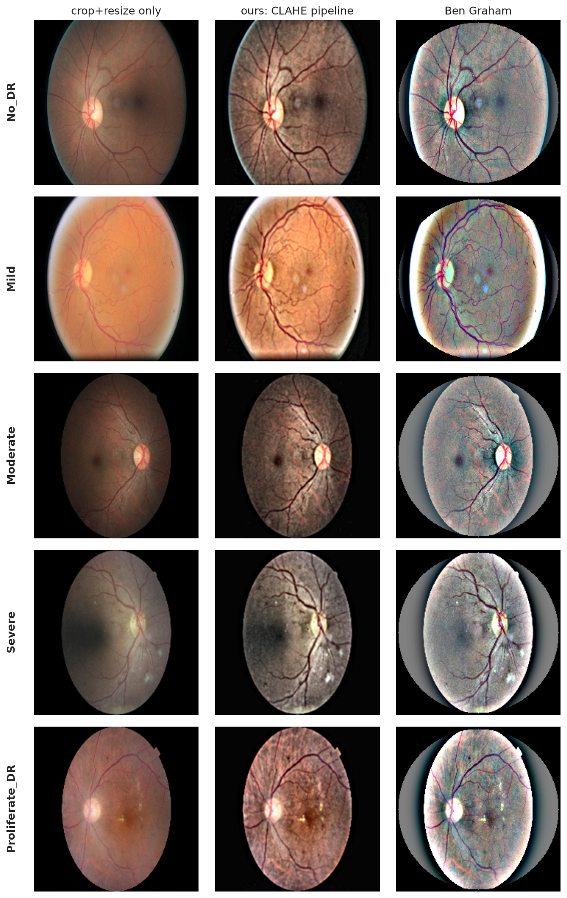
*Figure 8 – Crop-only, CLAHE pipeline, and Ben Graham normalisation.*

### 3.4 Quantitative evidence

Three objective image-quality measures were computed on 400 random training images (Figure 9): contrast (standard deviation of grey levels), sharpness (variance of the Laplacian) and entropy of the grey histogram.

| Method | Contrast | Sharpness | Entropy (bits) |
|---|---|---|---|
| Crop + resize only | 50.5 | 278 | 5.23 |
| **CLAHE pipeline** | **57.8 (+14 %)** | **417 (+50 %)** | **5.96 (+0.73)** |
| Ben Graham | 71.4 | 3,143 | 6.03 |

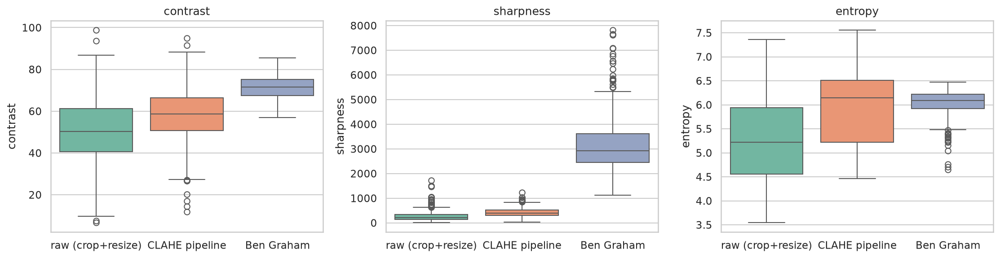
*Figure 9 – Distribution of the three quality measures per method.*

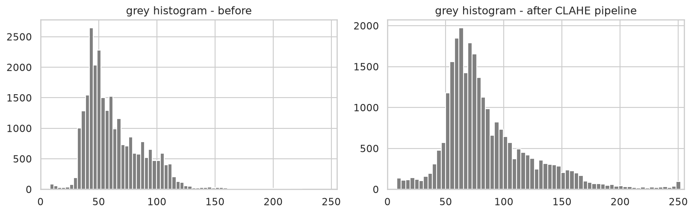
*Figure 10 – Grey-level histogram of one image before and after the pipeline: the dynamic range is fully used.*

The unsharp amount (1.5) was chosen by a small sweep: with the default amount of 1.0 the denoising step cancelled the sharpening gain (Laplacian variance 280 vs 278 raw). Ben Graham's very high Laplacian variance is largely amplified noise from its strong high-pass filter, which is why the visual comparison rather than this number decided the choice.

---

## 4. Data Augmentation and Class Balancing

### 4.1 Augmentation strategy

Augmentation is applied on the fly inside the `tf.data` pipeline (`src/dataset.py`) so that every epoch sees a different variant of each image: over 30 epochs the network is exposed to ~740,000 distinct training views of 24,588 originals.

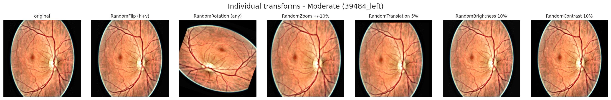
*Figure 11 – Each transform in isolation.*

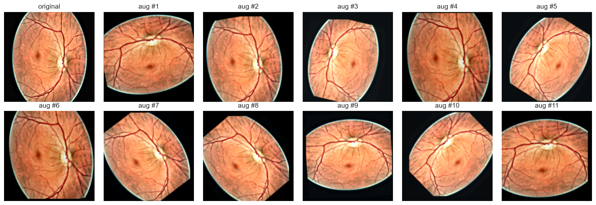
*Figure 12 – Eleven random draws of the full augmentation stack for one Moderate image.*

| Transform | Setting | Kept? | Reason |
|---|---|---|---|
| Horizontal + vertical flip | — | ✓ | A fundus has no canonical orientation; left and right eyes are mirror images. Label-preserving. |
| Rotation | any angle in ±180° | ✓ | Same argument; the retina is rotationally symmetric apart from disc position. |
| Zoom | ±10 % | ✓ | Different camera fields of view. Small enough that peripheral lesions stay in frame. |
| Translation | ±5 % | ✓ | Retina not always centred. |
| Brightness / contrast | ±10 % | ✓ | Residual exposure differences between clinics; kept mild because CLAHE has already normalised exposure. |
| Shear | — | ✗ | Distorts the shape of microaneurysms and exudates, which is a diagnostic cue. |
| Hue / saturation shift | — | ✗ | Colour *is* the cue: haemorrhages are dark red, exudates yellow-white. |
| Cut-out / mixup | — | ✗ | May erase or blend the single tiny lesion that separates Mild from No DR. |

### 4.2 Handling the 36 : 1 imbalance

Two complementary remedies were implemented so that they could be compared empirically rather than assumed:

**Class-weighted loss.** Each sample's loss is multiplied by `w_c = N / (K·n_c)` (scikit-learn "balanced"), giving weights 0.27 / 2.88 / 1.33 / 8.05 / 9.93 for stages 0–4: a mistake on a Proliferative image costs 37× a mistake on a healthy one. No data is duplicated, but very large weights make gradients noisy.

**Oversampling at batch level.** Five per-class streams are interleaved with `tf.data.sample_from_datasets` using either `sqrt` weights (rare classes ≈ 8 % of each batch, No DR ≈ 47 %) or fully `balanced` weights (20 % each). Rare images are then repeated up to ~35× per epoch, which is only safe because of the augmentation above.

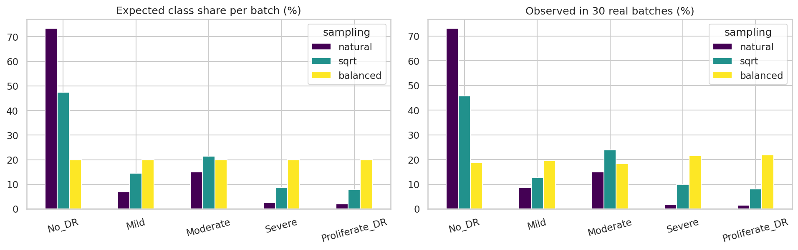
*Figure 13 – Expected vs observed class share per batch under natural, sqrt and balanced sampling (30 real batches each).*

The choice between *no balancing*, *class weights* and *sqrt oversampling* is made in §5.2 with validation macro-F1 and kappa.

### 4.3 Input pipeline throughput

The cached, preprocessed PNGs let the CPU-side pipeline deliver about 1,700 images/s without and 500 images/s with augmentation on a laptop CPU, comfortably above what one T4 GPU consumes for a 224-px EfficientNet, so training is compute-bound rather than I/O-bound.

---

## 5. CNN Architecture, Transfer Learning and Training Strategy

_[To be completed from notebook 04 results: experiment table E0–E4, architecture diagram, curves.]_

## 6. Evaluation and Performance Analysis

_[To be completed from notebook 05 results: test metrics, confusion matrices, ROC/PR, referable DR, error analysis, Grad-CAM.]_

## 7. Code Quality and Reproducibility

_[Repository layout, modules, seeds, how to run.]_

## 8. Prototype and Demonstration Video

_[Gradio app description + video URL.]_

## 9. Discussion: Impact, Limitations, Ethics and Future Work

_[To be written.]_

## 10. Conclusion

_[To be written.]_

## References

[1] Yau, J. W. Y. et al. (2012). Global prevalence and major risk factors of diabetic retinopathy. *Diabetes Care*, 35(3), 556–564.
[2] Gulshan, V. et al. (2016). Development and validation of a deep learning algorithm for detection of diabetic retinopathy in retinal fundus photographs. *JAMA*, 316(22), 2402–2410.
[3] Wilkinson, C. P. et al. (2003). Proposed international clinical diabetic retinopathy and diabetic macular edema disease severity scales. *Ophthalmology*, 110(9), 1677–1682.
[4] Rath, S. (2019). Diabetic Retinopathy 2015 Data Colored Resized. Kaggle. https://www.kaggle.com/datasets/sovitrath/diabetic-retinopathy-2015-data-colored-resized
[5] Kaggle / EyePACS (2015). Diabetic Retinopathy Detection competition. https://www.kaggle.com/c/diabetic-retinopathy-detection
[6] Zuiderveld, K. (1994). Contrast limited adaptive histogram equalization. In *Graphics Gems IV*, 474–485.
[7] Graham, B. (2015). Kaggle Diabetic Retinopathy Detection competition report. University of Warwick.
[8] Tan, M. & Le, Q. (2019). EfficientNet: Rethinking model scaling for convolutional neural networks. *ICML*.
[9] He, K. et al. (2016). Identity mappings in deep residual networks. *ECCV*.
[10] Huang, G. et al. (2017). Densely connected convolutional networks. *CVPR*.
[11] Selvaraju, R. R. et al. (2017). Grad-CAM: Visual explanations from deep networks via gradient-based localization. *ICCV*.
[12] Cohen, J. (1968). Weighted kappa: Nominal scale agreement with provision for scaled disagreement or partial credit. *Psychological Bulletin*, 70(4), 213–220.
