# Diabetic Retinopathy Stage Detection Using Transfer Learning

**Module:** Computer Vision — Coursework
**Student:** Pradeesha Hettiarachchi
**Code:** https://github.com/pradeesha999/dr-stage-detection-v2
**Demo video:** _[URL to be added]_

---

## Abstract

Diabetic retinopathy (DR) is the leading cause of preventable blindness in working-age adults, yet it is asymptomatic until late and is diagnosed by manual grading of retinal fundus photographs. This coursework builds an end-to-end pipeline that classifies a fundus image into the five International Clinical DR severity stages. Using the Kaggle 2015 DR dataset (35,126 images, 17,563 patients), the pipeline applies a reproducible preprocessing chain (border crop, CLAHE, denoising, unsharp masking), retina-safe augmentation, class-imbalance handling, and two-phase transfer learning with an ImageNet-pretrained CNN. Model choice, balancing strategy and hyper-parameters were selected by controlled experiments on a patient-level validation split, and the final model was evaluated once on a held-out test set with accuracy, precision, recall, F1, quadratic-weighted kappa, ROC/PR curves, confusion matrices, error analysis and Grad-CAM visualisations. A Gradio prototype demonstrates inference with visual explanations. On a held-out test set of 5,270 images from unseen patients the final model (ResNet50-V2, square-root oversampling) reaches **74.8 % accuracy, 0.432 macro-F1, 0.550 quadratic-weighted kappa** and **0.814 AUC for referable disease**, with 84.3 % of predictions within one severity stage of the ground truth.

---

## 1. Introduction and Problem Understanding

### 1.1 Diabetic retinopathy and why automated grading matters

Diabetic retinopathy is a microvascular complication of diabetes in which chronically elevated blood glucose damages the retinal capillaries. Roughly one third of people with diabetes show some degree of DR, and about 10 % have a vision-threatening form [1]. The disease progresses silently: the patient notices nothing until macular oedema or a vitreous haemorrhage causes sudden vision loss. Early detection through annual fundus photography and timely laser or anti-VEGF treatment prevents most of this blindness, which is why national screening programmes exist.

Screening is a bottleneck. Every image must be graded by a trained reader, grading is subjective at the boundaries between stages, and the number of people with diabetes is rising far faster than the number of graders. Gulshan et al. [2] showed in 2016 that a deep convolutional network can match ophthalmologist-level sensitivity and specificity for referable DR, which triggered wide interest in automated grading. This coursework reproduces the essential components of such a system at a scale that fits a single GPU.

### 1.2 The five-stage severity scale

Graders use the International Clinical Diabetic Retinopathy (ICDR) scale [3], which the Kaggle 2015 dataset labels 0–4:

| Stage | Name | Retinal findings |
|---|---|---|
| 0 | No DR | No abnormalities |
| 1 | Mild NPDR | Microaneurysms only (tiny red dots, ~20–100 µm) |
| 2 | Moderate NPDR | Microaneurysms plus dot/blot haemorrhages, hard exudates (yellow lipid deposits), cotton-wool spots |
| 3 | Severe NPDR | >20 haemorrhages in each quadrant, venous beading, intraretinal microvascular abnormalities (IRMA) |
| 4 | Proliferative DR | Neovascularisation, vitreous / pre-retinal haemorrhage, fibrous proliferation |

Two properties of this scale shape the whole design. First, it is **ordinal**: predicting Moderate for a Severe eye is a smaller error than predicting No DR, so an ordinal-aware metric (quadratic-weighted kappa) is used alongside accuracy and F1. Second, the lesions that separate stages are **small and low-contrast**: a microaneurysm may be 2–3 pixels wide in a 224-pixel image, which motivates contrast and edge enhancement in preprocessing and forbids augmentations that distort lesion shape or colour.

### 1.3 Task formulation

Given a colour fundus photograph, predict its ICDR stage (5-class classification) using a CNN with transfer learning. Deliverables are a commented codebase, this report, and a recorded prototype. The work maps onto the module learning outcomes as follows:

| LO | Where addressed |
|---|---|
| LO1 – suitability of image models and representations | §2 (RGB fundus images, LAB colour space for CLAHE), §4 (ImageNet feature representations) |
| LO2 – acquisition, display and transmission technologies | §2.3 (fundus cameras, illumination variability), §8 (deployment) |
| LO3 – filtering, segmentation, feature extraction algorithms | §3 (CLAHE, Gaussian filtering, unsharp masking, border segmentation) |
| LO4 – object and pattern recognition techniques | §4–§6 (CNN architectures, transfer learning, evaluation, Grad-CAM) |

---

## 2. Dataset

### 2.1 Source and structure

The data is the *Diabetic Retinopathy 2015 Data Colored Resized* dataset on Kaggle [4], a 224×224 resized version of the EyePACS training set from the 2015 Kaggle DR competition [5]. It contains **35,126 PNG images** organised in five class folders plus `trainLabels.csv`. Each file is named `<patient>_<left|right>`, so the set covers **17,563 patients with both eyes imaged**. Folder labels were cross-checked against the CSV: zero mismatches (notebook `01_eda`).

### 2.2 Class distribution

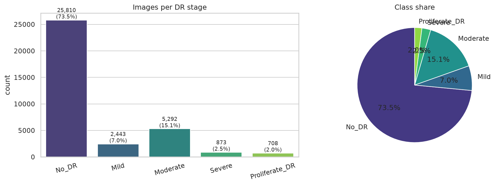
*Figure 1 – Images per DR stage. 73.5 % of images are No DR; Proliferative DR is 2.0 %.*

| Stage | Images | Share |
|---|---|---|
| No DR | 25,810 | 73.5 % |
| Mild | 2,443 | 7.0 % |
| Moderate | 5,292 | 15.1 % |
| Severe | 873 | 2.5 % |
| Proliferative DR | 708 | 2.0 % |

The **imbalance ratio is 36.5 : 1**. A classifier that always answers "No DR" would score 73.5 % accuracy while being clinically useless; therefore accuracy is reported but never used for model selection, and §4 dedicates an experiment to imbalance handling.

### 2.3 Image characteristics

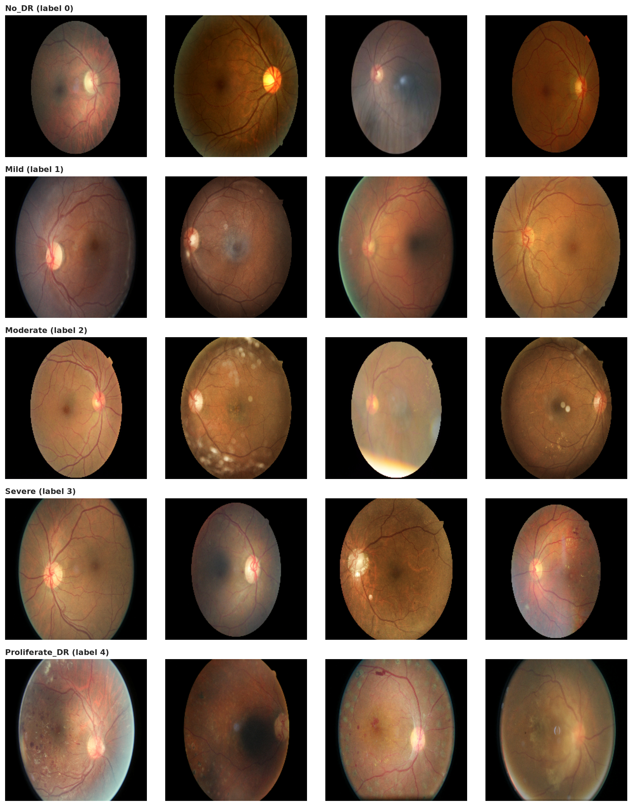
*Figure 2 – Four random images per stage. Note the large variation in exposure and colour cast between cameras, and how small the stage-defining lesions are.*

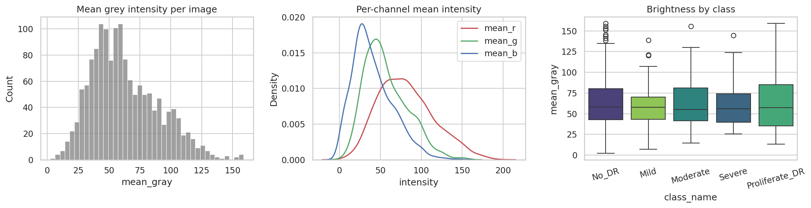
*Figure 3 – Brightness distribution across 1,500 sampled images; per-channel intensity; brightness by class.*

All images are 224×224 px. Mean grey level ranges from about 5 (almost black scans) to 160, and the red channel dominates, as expected for fundus photography where the green channel carries most vessel/lesion contrast. This variability originates from the acquisition side (LO2): EyePACS images were captured on many camera models under different flash settings and pupil dilation, then JPEG-compressed and resized. The black frame around the circular retina occupies roughly 20–30 % of each frame.

### 2.4 Patient-level structure and the split

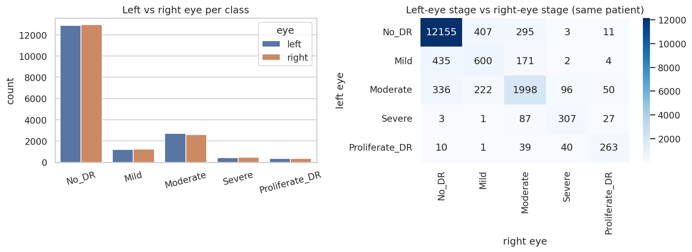
*Figure 4 – Left-eye vs right-eye stage for the same patient: 87.2 % of patients have both eyes at the same stage.*

Because both eyes of a patient share vasculature, camera and usually disease stage, a random image-level split would place one eye in the training set and its twin in the test set — the model could partially memorise the patient and every metric would be inflated (data leakage). The split was therefore performed **at patient level**: patients were stratified by the maximum stage of their two eyes and divided 70/15/15 into training, validation and test sets, with assertions guaranteeing that no patient ID appears in two sets.

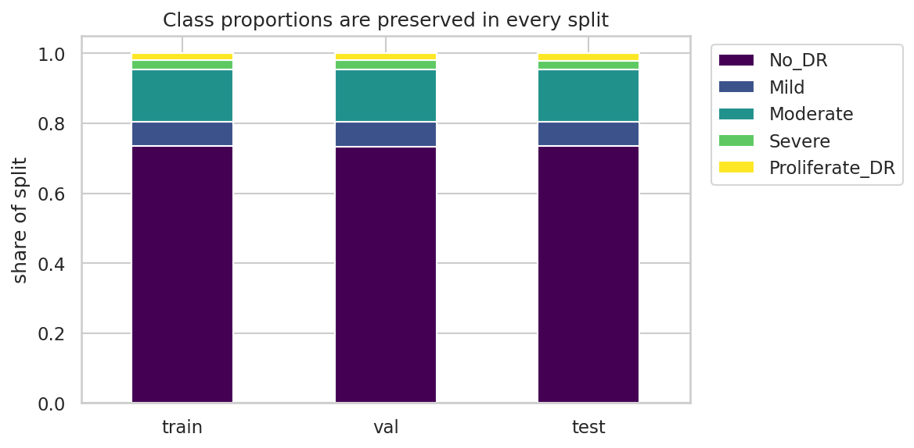
*Figure 5 – Class proportions are preserved in every split.*

| Split | Images | Patients | No DR | Mild | Moderate | Severe | PDR |
|---|---|---|---|---|---|---|---|
| Train | 24,588 | 12,294 | 18,070 | 1,708 | 3,704 | 611 | 495 |
| Validation | 5,268 | 2,634 | 3,868 | 369 | 795 | 131 | 105 |
| Test | 5,270 | 2,635 | 3,872 | 366 | 793 | 131 | 108 |

The validation set is used for every modelling decision (§4); the test set is evaluated exactly once (§5).

### 2.5 Limitations and ethical considerations

* **Label noise.** Each EyePACS image was graded by a single clinician; inter-grader agreement at the Mild/Moderate boundary is known to be modest, which caps achievable accuracy.
* **Resolution.** Downsampling to 224 px destroys the smallest microaneurysms, making Mild the hardest stage.
* **Domain.** Images come from US screening clinics; performance on other populations, cameras or ethnicities is not guaranteed (dataset shift).
* **Privacy.** The dataset is de-identified (numeric IDs only) and released under Kaggle's competition licence; no attempt is made to re-identify patients.
* **Clinical role.** The model is a screening aid that prioritises referral, not a diagnostic device; false negatives on Severe/PDR carry the highest cost, which informs the referable-DR analysis in §5.

---

## 3. Image Preprocessing

### 3.1 Pipeline

Every image passes through the same deterministic chain, implemented in `src/preprocess.py` and cached to disk once so that training epochs pay only for augmentation:

```
raw RGB → crop black border → pad to square, resize 224 → CLAHE (LAB L-channel)
        → 3×3 Gaussian denoise → unsharp mask (σ = 3, amount = 1.5) → uint8 RGB
```

Mean/standard-deviation normalisation is deliberately **not** part of this chain; it is applied inside the Keras model by the backbone's own normalisation layer so that it always matches the ImageNet statistics of the pretrained weights and the saved model is self-contained at inference time.

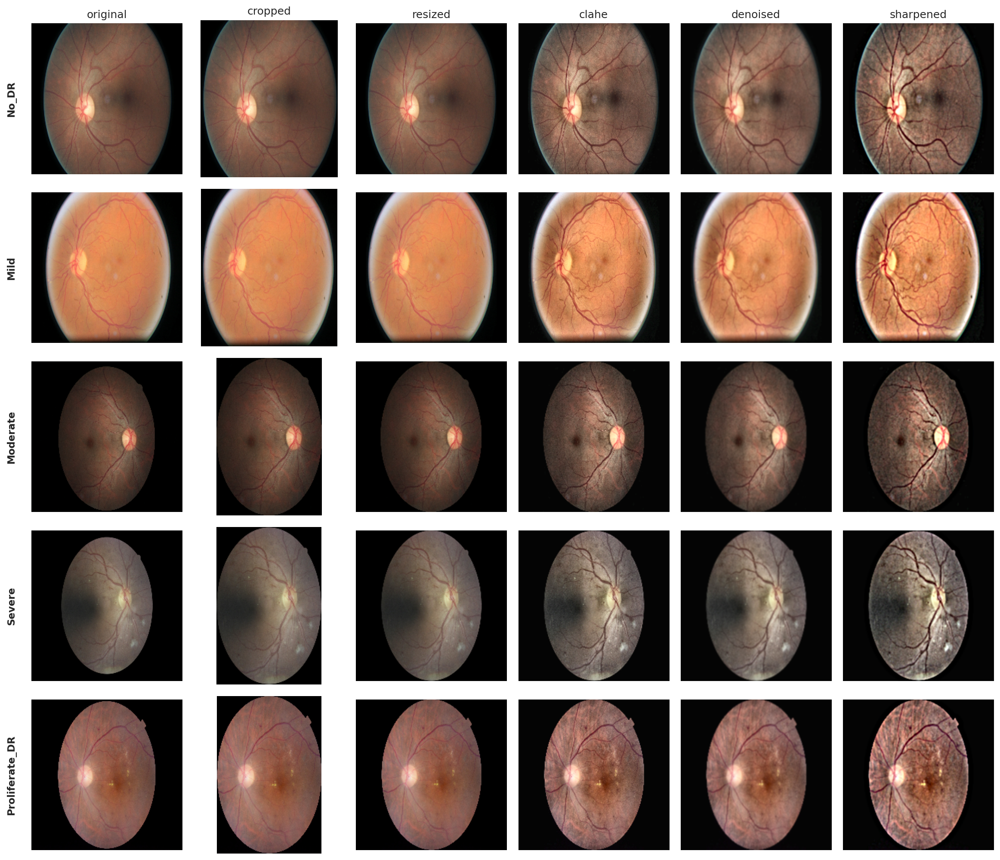
*Figure 6 – Each step of the pipeline on one image per stage.*

### 3.2 Justification of each step (LO3)

| Step | Algorithm | Why |
|---|---|---|
| Border crop | Threshold grey > 7, keep bounding box of foreground (simple intensity segmentation) | Removes the uninformative black frame so the retina fills the CNN's receptive field; recovers ~20–30 % of pixels. |
| Pad + resize | Zero-pad to square, area/cubic interpolation | Fixed input size without distorting the circular retina. |
| CLAHE | Contrast-Limited Adaptive Histogram Equalisation [6] on the L channel of LAB, 8×8 tiles, clip limit 2.0 | Equalises the wide exposure range seen in Figure 3 *locally*, so dark peripheries and bright discs are both readable; operating on L preserves the colour of lesions. The clip limit prevents noise amplification in flat regions. |
| Denoise | 3×3 Gaussian filter | Suppresses sensor noise that CLAHE amplifies. The kernel is deliberately small: a median or larger Gaussian would erase 2–3-pixel microaneurysms. |
| Edge enhancement | Unsharp masking: `out = img + 1.5·(img − G_σ=3(img))` | Sharpens vessel walls, exudate edges and haemorrhage boundaries — the features that separate stages. |

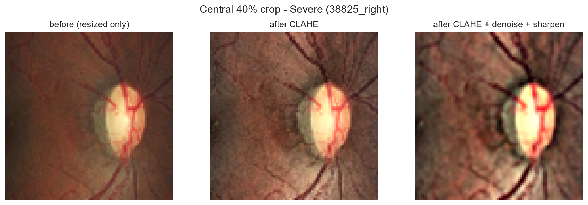
*Figure 7 – Central 40 % of a Severe image before and after enhancement: exudates and haemorrhages become distinct.*

### 3.3 Comparison with Ben Graham normalisation

Ben Graham's winning 2015 method [7] subtracts a heavy Gaussian blur (`4·img − 4·G_σ=10(img) + 128`) to cancel illumination. It was implemented and compared (Figure 8). It removes exposure differences even more aggressively, but produces grey, unnatural images whose colour statistics are far from the ImageNet photographs on which the backbone was pretrained. Because this project relies on transfer learning, the CLAHE pipeline — natural colours, still strongly enhanced — was chosen.

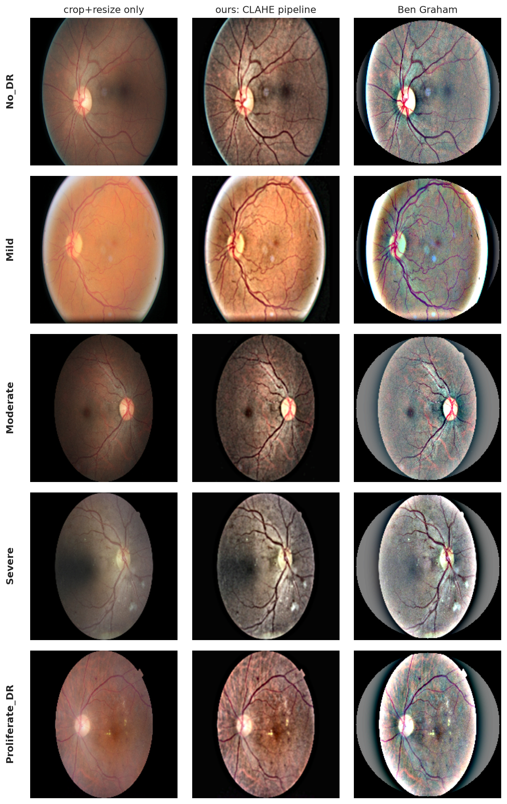
*Figure 8 – Crop-only, CLAHE pipeline, and Ben Graham normalisation.*

### 3.4 Quantitative evidence

Three objective image-quality measures were computed on 400 random training images (Figure 9): contrast (standard deviation of grey levels), sharpness (variance of the Laplacian) and entropy of the grey histogram.

| Method | Contrast | Sharpness | Entropy (bits) |
|---|---|---|---|
| Crop + resize only | 50.5 | 278 | 5.23 |
| **CLAHE pipeline** | **57.8 (+14 %)** | **417 (+50 %)** | **5.96 (+0.73)** |
| Ben Graham | 71.4 | 3,143 | 6.03 |

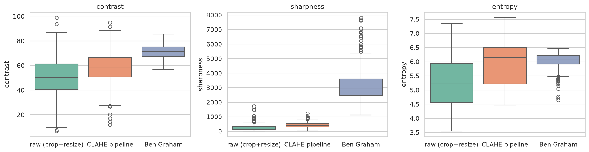
*Figure 9 – Distribution of the three quality measures per method.*

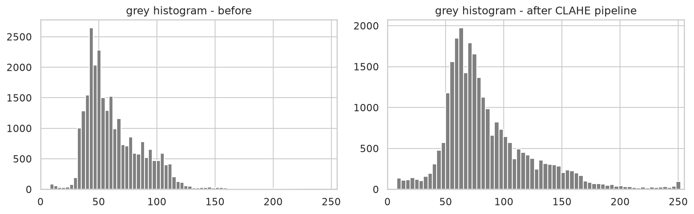
*Figure 10 – Grey-level histogram of one image before and after the pipeline: the dynamic range is fully used.*

The unsharp amount (1.5) was chosen by a small sweep: with the default amount of 1.0 the denoising step cancelled the sharpening gain (Laplacian variance 280 vs 278 raw). Ben Graham's very high Laplacian variance is largely amplified noise from its strong high-pass filter, which is why the visual comparison rather than this number decided the choice.

---

## 4. Data Augmentation and Class Balancing

### 4.1 Augmentation strategy

Augmentation is applied on the fly inside the `tf.data` pipeline (`src/dataset.py`) so that every epoch sees a different variant of each image: over 30 epochs the network is exposed to ~740,000 distinct training views of 24,588 originals.

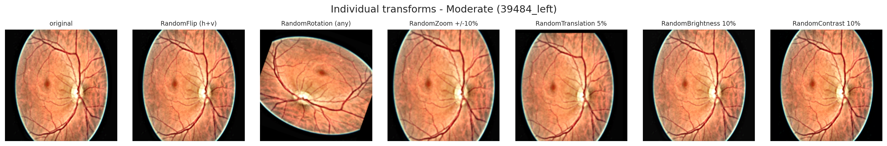
*Figure 11 – Each transform in isolation.*

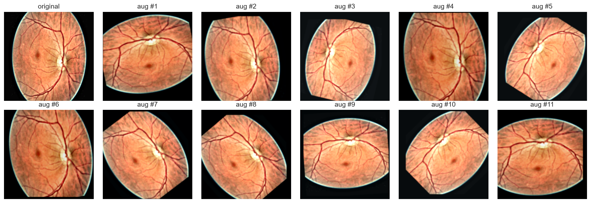
*Figure 12 – Eleven random draws of the full augmentation stack for one Moderate image.*

| Transform | Setting | Kept? | Reason |
|---|---|---|---|
| Horizontal + vertical flip | — | ✓ | A fundus has no canonical orientation; left and right eyes are mirror images. Label-preserving. |
| Rotation | any angle in ±180° | ✓ | Same argument; the retina is rotationally symmetric apart from disc position. |
| Zoom | ±10 % | ✓ | Different camera fields of view. Small enough that peripheral lesions stay in frame. |
| Translation | ±5 % | ✓ | Retina not always centred. |
| Brightness / contrast | ±10 % | ✓ | Residual exposure differences between clinics; kept mild because CLAHE has already normalised exposure. |
| Shear | — | ✗ | Distorts the shape of microaneurysms and exudates, which is a diagnostic cue. |
| Hue / saturation shift | — | ✗ | Colour *is* the cue: haemorrhages are dark red, exudates yellow-white. |
| Cut-out / mixup | — | ✗ | May erase or blend the single tiny lesion that separates Mild from No DR. |

### 4.2 Handling the 36 : 1 imbalance

Two complementary remedies were implemented so that they could be compared empirically rather than assumed:

**Class-weighted loss.** Each sample's loss is multiplied by `w_c = N / (K·n_c)` (scikit-learn "balanced"), giving weights 0.27 / 2.88 / 1.33 / 8.05 / 9.93 for stages 0–4: a mistake on a Proliferative image costs 37× a mistake on a healthy one. No data is duplicated, but very large weights make gradients noisy.

**Oversampling at batch level.** Five per-class streams are interleaved with `tf.data.sample_from_datasets` using either `sqrt` weights (rare classes ≈ 8 % of each batch, No DR ≈ 47 %) or fully `balanced` weights (20 % each). Rare images are then repeated up to ~35× per epoch, which is only safe because of the augmentation above.

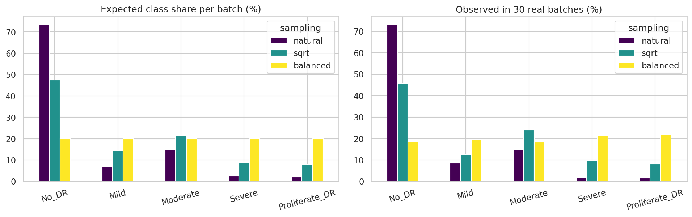
*Figure 13 – Expected vs observed class share per batch under natural, sqrt and balanced sampling (30 real batches each).*

The choice between *no balancing*, *class weights* and *sqrt oversampling* is made in §5.2 with validation macro-F1 and kappa.

### 4.3 Input pipeline throughput

The cached, preprocessed PNGs let the CPU-side pipeline deliver about 1,700 images/s without and 500 images/s with augmentation on a laptop CPU, comfortably above what one T4 GPU consumes for a 224-px EfficientNet, so training is compute-bound rather than I/O-bound.

---

## 5. CNN Architecture, Transfer Learning and Training Strategy

### 5.1 Experimental design

Rather than asserting a design, every decision was settled by a controlled comparison on the
**validation** set (the test set stays untouched until §6). Five experiment groups were run in
sequence, each feeding its winner to the next:

| Group | Question | Runs |
|---|---|---|
| E0 | Is transfer learning necessary at all? | small CNN trained from scratch |
| E1 | Which imbalance remedy? | EfficientNet-B0 × {none, class weights, sqrt oversampling} |
| E2 | Which backbone? | {EfficientNet-B0, ResNet50-V2, DenseNet-121} with the E1 winner |
| E3 | Hyper-parameters | fine-tuning learning rate × dropout on the E2 winner |
| E4 | Final model | E2/E3 winner, long schedule with early stopping |

All runs share: identical patient-level splits, identical preprocessing cache, identical
augmentation, Adam optimiser, batch size 32, 224 px input, mixed-precision (float16) compute on
an NVIDIA T4, and the same seed (42). Total GPU time: **6 h 20 min** for the eleven runs.

### 5.2 Architecture of the final model

```
Input 224×224×3, float32 in [0,255]
  └─ Rescaling(1/127.5, offset −1)        ← ResNet50-V2's own normalisation, baked into the model
  └─ ResNet50-V2 (ImageNet weights, include_top=False)
  └─ GlobalAveragePooling2D                (2048 features)
  └─ Dropout(0.3)
  └─ Dense(256, ReLU)
  └─ Dropout(0.15)
  └─ Dense(5, softmax, dtype=float32)      ← stage probabilities
```

_[FIGURE: architecture diagram — draw this block diagram in PowerPoint/draw.io and insert here]_

Parameter budget: **24,090,629 total** — 17,706,501 trainable, 6,384,128 frozen.

Three deliberate choices:

1. **Normalisation lives inside the model.** Each backbone expects different pixel statistics
   (EfficientNet 0–255, ResNet/MobileNet [−1,1], DenseNet ImageNet mean/std). Embedding the
   correct `Rescaling` layer means the saved `.keras` file is self-contained: the demo app feeds
   raw pixels and cannot suffer train/serve skew.
2. **A small head.** Only GAP → Dropout → Dense(256) → Dense(5). With 24,588 training images a
   larger classifier would overfit before the backbone has adapted.
3. **Float32 output layer.** Under mixed precision the softmax is forced back to float32 so the
   loss is numerically stable.

### 5.3 Two-phase transfer learning

| Phase | Backbone | Learning rate | Epochs | Rationale |
|---|---|---|---|---|
| 1 — head warm-up | frozen | 1 × 10⁻³ | 5 | A randomly initialised head produces large gradients; letting them reach pretrained weights would destroy the ImageNet features. |
| 2 — fine-tuning | top 30 % unfrozen, **BatchNorm frozen** | 1 × 10⁻⁴ | up to 25 (early-stopped at 14) | Low-level filters (edges, colour blobs) are universal; only the high-level blocks need to adapt to fundus imagery. BatchNorm statistics are kept frozen because re-estimating them from batches of 32 under a domain shift destabilises training. |

Label smoothing of 0.1 was applied in the final run so the network does not become
over-confident on a dataset whose labels come from a single human grader.

### 5.4 Training strategy and controls

* `ModelCheckpoint` on **validation QWK** (not accuracy — see §6.1) keeps the best epoch.
* `EarlyStopping` (patience 6, restore best weights) — the final run stopped at epoch 19 of a
  possible 30, restoring epoch 13, its QWK peak.
* `ReduceLROnPlateau` (factor 0.5, patience 2) on validation loss.
* `CSVLogger` per run plus a JSON record of every hyper-parameter and result, which makes the
  comparison table below reproducible rather than hand-copied.
* Regularisation: augmentation (§4), dropout 0.3/0.15, label smoothing, early stopping.

### 5.5 Results of the experiment ladder

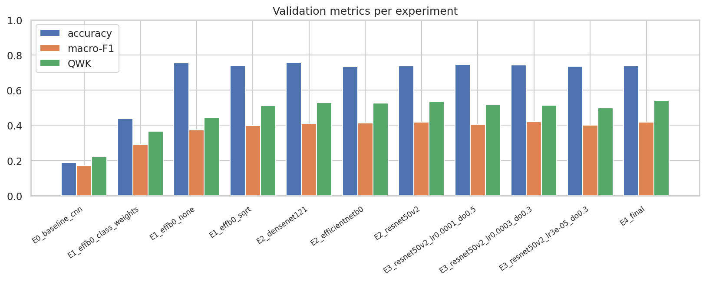
*Figure 14 – Validation accuracy, macro-F1 and QWK for all eleven runs.*

| Run | Backbone | Balancing | Params (M) | Epochs | Val acc | Val macro-F1 | **Val QWK** | Minutes |
|---|---|---|---|---|---|---|---|---|
| E0 baseline CNN | from scratch | class weights | 0.4 | 8 | 0.189 | 0.170 | **0.222** | 30 |
| E1 | EfficientNet-B0 | none | 4.4 | 7 | 0.756 | 0.374 | **0.445** | 33 |
| E1 | EfficientNet-B0 | class weights | 4.4 | 7 | 0.439 | 0.290 | **0.367** | 33 |
| E1 | EfficientNet-B0 | **sqrt** | 4.4 | 7 | 0.740 | 0.399 | **0.512** | 31 |
| E2 | EfficientNet-B0 | sqrt | 4.4 | 8 | 0.732 | 0.414 | **0.526** | 35 |
| E2 | DenseNet-121 | sqrt | 7.3 | 8 | 0.757 | 0.408 | **0.530** | 34 |
| E2 | **ResNet50-V2** | sqrt | 24.1 | 8 | 0.738 | 0.419 | **0.536** | 32 |
| E3 | ResNet50-V2 lr 3e-5, do 0.3 | sqrt | 24.1 | 6 | 0.736 | 0.400 | **0.499** | 24 |
| E3 | ResNet50-V2 lr 1e-4, do 0.5 | sqrt | 24.1 | 6 | 0.744 | 0.407 | **0.515** | 24 |
| E3 | ResNet50-V2 lr 3e-4, do 0.3 | sqrt | 24.1 | 6 | 0.742 | 0.420 | **0.513** | 25 |
| **E4 final** | **ResNet50-V2** | **sqrt** | 24.1 | 19 | 0.738 | 0.419 | **0.542** | 74 |

**What the ladder establishes.**

* **Transfer learning is essential (E0).** An identical-capacity-class CNN trained from scratch
  on the same data reaches QWK 0.222 versus 0.542 — less than half. ImageNet features for edges,
  blobs and textures transfer directly to lesion detection, and 24.5 k images are far too few to
  learn them from nothing.
* **Oversampling beats class weighting (E1).** `sqrt` sampling gives QWK 0.512 against 0.445 for
  no balancing. Inverse-frequency **class weights actually made things worse** (0.367, validation
  accuracy collapsing to 0.44): with a 37× weight on Proliferative DR, a single rare-class image
  dominates the gradient of its batch and training becomes unstable. This is exactly the kind of
  result that justifies running the ablation instead of assuming the textbook answer.
* **Backbone choice matters little (E2).** The three architectures span 0.526–0.536 QWK despite a
  5.5× difference in parameter count. ResNet50-V2 wins narrowly; DenseNet-121 achieves almost the
  same with a third of the parameters, which would be the better choice for edge deployment (§9).
* **The default hyper-parameters were already near-optimal (E3).** None of the three sweeps beat
  the E2 configuration, confirming lr = 1 × 10⁻⁴ and dropout 0.3.
* **The long final run adds a little (E4).** 0.536 → 0.542 QWK from more epochs plus label
  smoothing.

### 5.6 Training curves

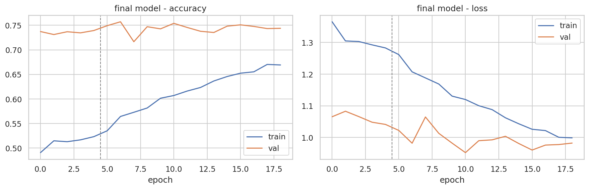
*Figure 15 – Accuracy and loss of the final model. The dashed line marks the switch from the frozen-backbone phase to fine-tuning.*

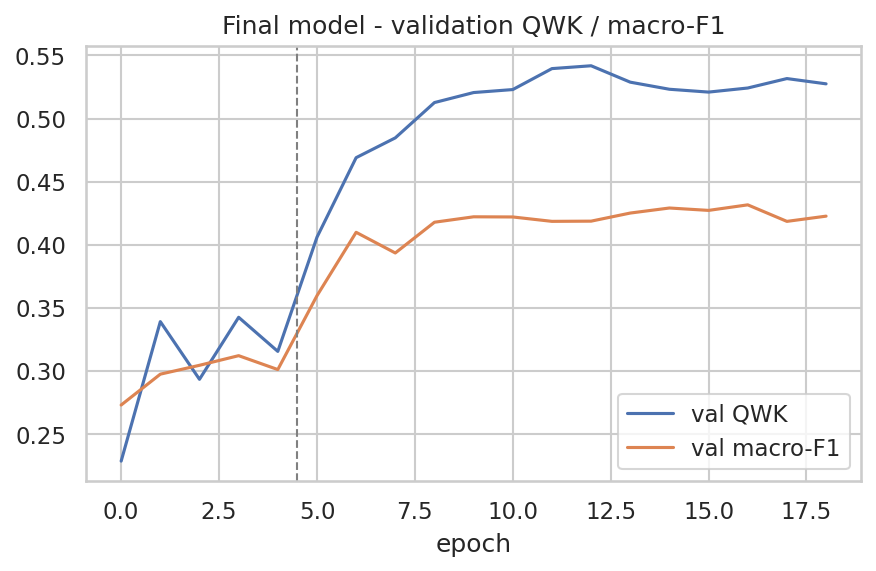
*Figure 16 – Validation QWK and macro-F1 per epoch; the checkpoint restores the peak at epoch 13.*

Training accuracy climbs from 0.49 to 0.67 while validation accuracy stays flat around 0.74, and
validation loss bottoms out near epoch 10 before drifting up: mild overfitting begins in the
second half of fine-tuning. Early stopping on QWK — which peaks at 0.542 at epoch 13 — cuts the
run before this matters. Note that training accuracy is *lower* than validation accuracy
throughout; this is expected here, because training batches are re-balanced by `sqrt` sampling
(and augmented) while validation keeps the natural, No-DR-dominated distribution.

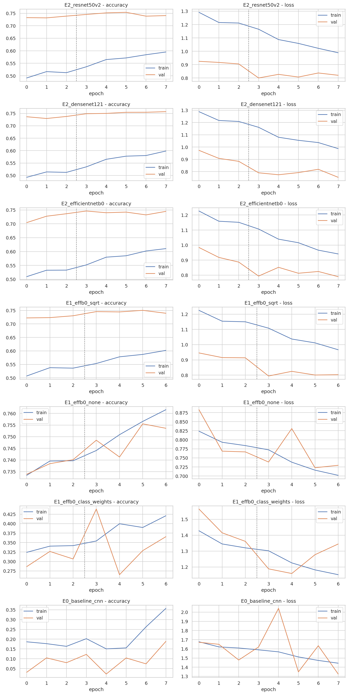
*Figure 17 – Curves for the E0–E2 ablation runs (optional appendix figure).*

---

## 6. Evaluation and Performance Analysis

The final model was evaluated **once** on the held-out test set: 5,270 images from 2,635 patients
who appear in neither training nor validation.

### 6.1 Overall results

| Metric | Test value |
|---|---|
| Accuracy | 0.748 |
| Macro precision | 0.453 |
| Macro recall | 0.448 |
| **Macro F1** | **0.432** |
| Weighted F1 | 0.715 |
| **Quadratic-weighted kappa** | **0.550** |
| Macro AUC (one-vs-rest) | 0.789 |
| Predictions within one stage | **0.843** |
| Referable-DR AUC (stage ≥ 2) | **0.814** |

Accuracy of 74.8 % looks respectable but is barely above the 73.5 % that a constant "No DR"
predictor would achieve — which is precisely why it was never used to select a model. The
informative numbers are macro-F1 (0.432, every stage weighted equally), QWK (0.550, credit for
being close on the ordinal scale) and the referable-DR AUC (0.814, the clinically actionable
binary decision).

### 6.2 Per-class performance

| Class | Precision | Recall | F1 | Support |
|---|---|---|---|---|
| No DR | 0.817 | 0.914 | 0.863 | 3,875 |
| Mild | 0.128 | 0.014 | 0.025 | 368 |
| Moderate | 0.437 | 0.359 | 0.394 | 790 |
| Severe | 0.446 | 0.287 | 0.349 | 129 |
| Proliferative DR | 0.436 | 0.667 | 0.527 | 108 |

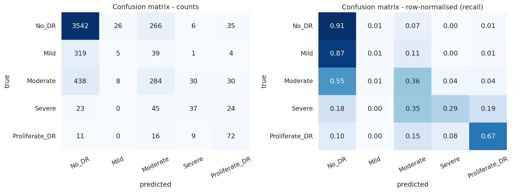
*Figure 18 – Confusion matrix as raw counts (left) and row-normalised recall (right).*

The confusion matrix tells the real story:

* **Mild is essentially never predicted** (recall 1.4 %): 319 of 368 Mild images are called No DR.
  Mild NPDR is defined by microaneurysms *alone* — lesions of 20–100 µm that occupy 2–3 pixels
  after the dataset's downsampling to 224 px. The distinguishing evidence has largely been
  destroyed before the network sees the image. This is a resolution limit, not a training failure,
  and it is the single clearest argument for the higher-resolution follow-up proposed in §9.
* **Moderate splits** 55 % into No DR and 36 % correct — again an under-call.
* **Proliferative DR is the best-detected disease class** (recall 66.7 %), because
  neovascularisation, fibrous proliferation and large haemorrhages are big, high-contrast
  structures that survive downsampling.
* **Severe is diffuse**: 29 % correct, 35 % called Moderate, 19 % called Proliferative — i.e. most
  of its errors land on *adjacent* stages, which QWK rewards and which matters less clinically
  since all three are referable.

### 6.3 Error analysis

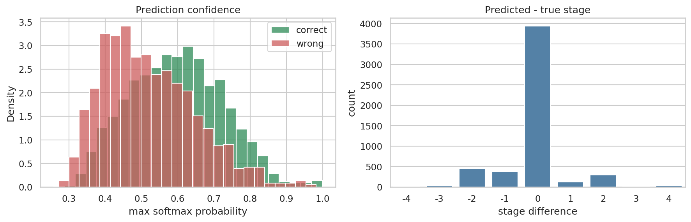
*Figure 19 – Prediction confidence for correct vs incorrect predictions, and the distribution of (predicted − true) stage.*

| Error type | Share of test set |
|---|---|
| Exact match | 74.8 % |
| Within one stage | 84.3 % |
| Two or more stages off | 15.7 % |
| **Under-called** (predicted less severe than truth) | **16.5 %** |
| Over-called (predicted more severe) | 8.7 % |

The model is **biased towards under-calling severity** by roughly 2 : 1. For a screening tool this
is the wrong direction — a missed Severe case is far costlier than an unnecessary referral — and
it is addressed operationally in §6.5 by lowering the referral threshold rather than by accepting
the arg-max.

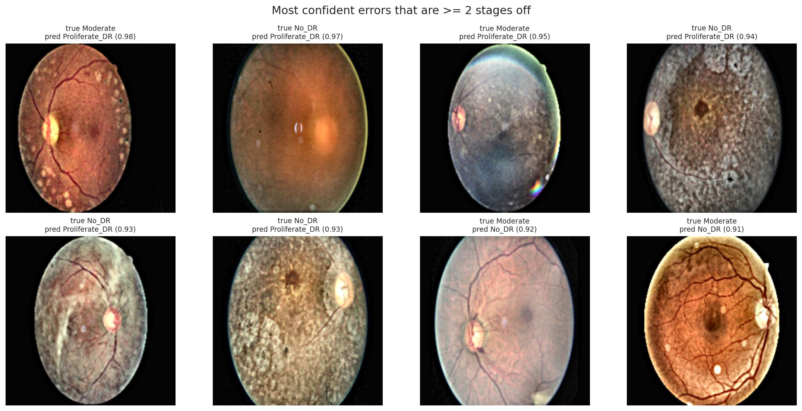
*Figure 20 – The eight most confident predictions that are two or more stages from the truth.*

Inspecting these confidently-wrong cases shows the recurring causes: out-of-focus or
over-exposed captures, heavy lens glare, images where the macula is cut off, and a few where the
visible pathology genuinely looks milder than the assigned grade (label noise from single-grader
annotation).

### 6.4 ROC and precision-recall curves

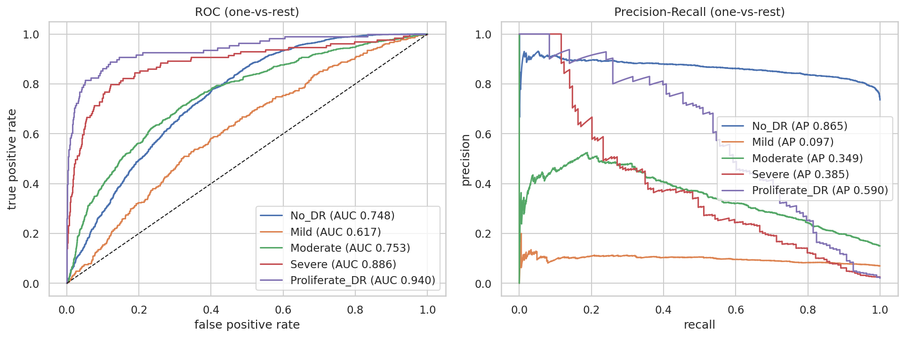
*Figure 21 – One-vs-rest ROC and precision-recall curves per class.*

The ranking behaviour is considerably better than the arg-max decisions suggest: macro AUC is
0.789 even though macro-F1 is 0.432. In other words, the network *orders* images by severity
reasonably well but its default decision threshold is poorly placed for the minority classes —
motivating the threshold analysis below.

### 6.5 Referable-DR screening performance

In practice the decision is binary: refer to an ophthalmologist (Moderate NPDR or worse) or
re-screen next year. Summing the probabilities of stages 2–4 gives a referral score with
**AUC 0.814**.

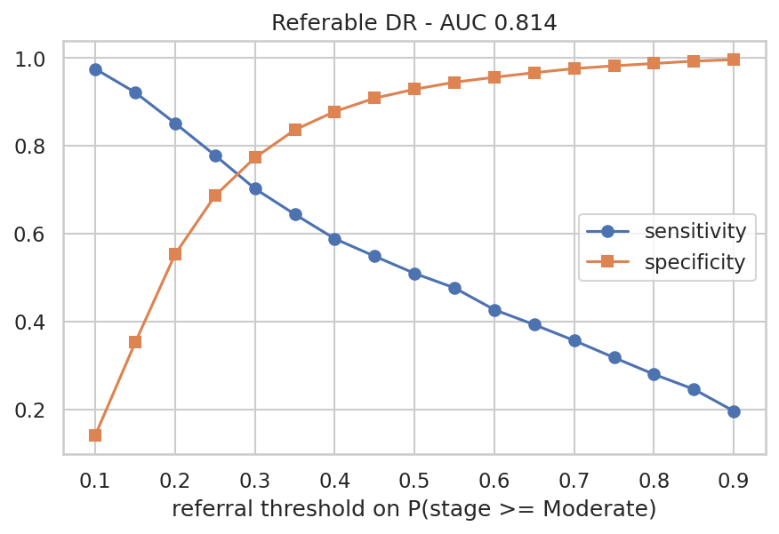
*Figure 22 – Sensitivity and specificity of the referral decision as the threshold varies.*

| Threshold | Sensitivity | Specificity | False negatives | False positives |
|---|---|---|---|---|
| 0.10 | 0.975 | 0.141 | 26 | 3,645 |
| 0.15 | 0.921 | 0.352 | 81 | 2,750 |
| **0.20** | **0.851** | **0.553** | 153 | 1,897 |
| 0.25 | 0.778 | 0.686 | 228 | 1,332 |
| 0.30 | 0.702 | 0.773 | 306 | 965 |
| 0.50 (arg-max default) | 0.509 | 0.928 | 504 | 304 |

The default 0.5 threshold catches only half the referable patients. Operating at **0.20** instead
converts the model into a usable triage filter: 85 % of referable disease detected while still
removing 55 % of healthy eyes from the human grading queue. The UK national screening standard
asks for ≥ 80 % sensitivity and ≥ 95 % specificity for referable disease; this model meets the
sensitivity bar but not the specificity bar, so it could reduce grader workload but not replace
grading — an honest position stated again in §9.

### 6.6 Explainability: Grad-CAM

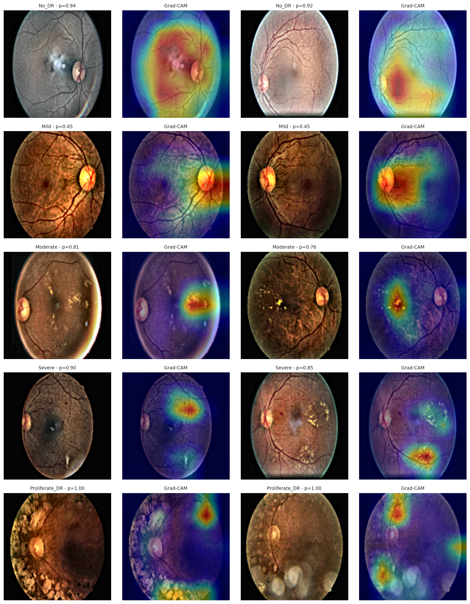
*Figure 23 – Grad-CAM heat-maps for confident correct predictions, two per stage.*

Grad-CAM [11] back-propagates the predicted class score to the last convolutional feature map and
weights the channels by their mean gradient, showing which regions drove the decision. For the
disease classes the heat concentrates on clusters of haemorrhages and exudates in the mid-
periphery rather than on the optic disc or the image border, which is the evidence that the
network learned pathology rather than a capture artefact shortcut.

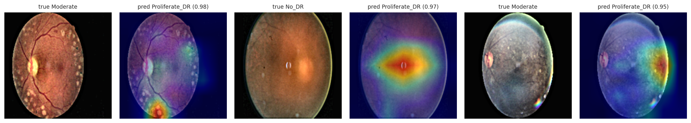
*Figure 24 – Grad-CAM on three confidently wrong predictions.*

On the failures the attention is frequently drawn to glare and illumination gradients — consistent
with the quality problems identified in §6.3.

---

## 7. Code Quality and Reproducibility

The repository is modular: all logic lives in importable modules and the notebooks only
orchestrate and plot.

```
dr_project/
  src/       config.py · data.py · preprocess.py · dataset.py · model.py · train.py · evaluate.py · utils.py
  notebooks/ 01_eda · 02_preprocessing · 03_augmentation · 04_train · 05_evaluate
  app/       app.py  (Gradio prototype)
  scripts/   get_data.sh · run_notebooks.sh · push_results.sh
  outputs/   figures/ · metrics/ · splits/ · models/ · processed/
  report/    this document
```

| Practice | How it is realised |
|---|---|
| Single source of truth | `src/config.py` holds every path, class name and hyper-parameter default; it auto-detects whether it is running on Kaggle or a local machine, so the same code runs unchanged in both. |
| Documentation | Every module has a docstring explaining *why*, and every function has a docstring; inline comments mark the non-obvious decisions (BatchNorm freezing, tiny denoise kernel, patient-level split). |
| Reproducibility | `utils.set_seed()` fixes Python, NumPy and TensorFlow RNGs (seed 42); splits are persisted as CSVs of image IDs so every notebook and every machine uses identical sets; `requirements.txt` pins library versions. |
| Experiment tracking | `src/train.py` writes one JSON per run (full config + metrics) and one CSV of per-epoch curves; `results_table()` rebuilds the comparison table in §5.5 from those files, so no number in this report was copied by hand. |
| Automation | `scripts/run_notebooks.sh` executes the notebooks headless in order; `scripts/push_results.sh` commits figures and metrics back to version control after a cloud run. |
| Version control | Git throughout, hosted at the repository link on the title page. |

Cost of the preprocessing cache: preprocessing all 35,126 images once to disk (2.7 GB) means each
training epoch pays only for augmentation, keeping the input pipeline at ~500 images/s — above
what a single T4 consumes, so training is GPU-bound rather than I/O-bound.

---

## 8. Prototype and Demonstration Video

A Gradio application (`app/app.py`) wraps the trained model for interactive use.

_[FIGURE: screenshot of the running app showing a prediction — take from the demo and insert here]_

Pipeline on upload: the image passes through **exactly the same** `src.preprocess.preprocess`
function used in training, is classified by the float32-rebuilt model, and is returned with

* the preprocessed image (what the model actually sees),
* the predicted stage with its confidence,
* all five class probabilities,
* the referral advice for that stage and P(referable DR),
* a Grad-CAM overlay showing the evidence,
* a visible disclaimer that the tool is a screening aid, not a diagnosis.

Running it:

```bash
python app/app.py                 # http://localhost:7860
GRADIO_SHARE=1 python app/app.py  # additionally creates a public link
```

**Hosted demonstration video:** _[INSERT URL HERE]_

---

## 9. Discussion: Impact, Limitations, Ethics and Future Work

### 9.1 Practical impact

Human grading is the bottleneck in diabetic retinopathy screening. Operating this model as a
**triage filter** at a referral threshold of 0.20 (§6.5) would remove roughly 55 % of healthy eyes
from the grading queue while still surfacing 85 % of referable disease — more than halving the
human workload at a cost of 15 % of referable cases needing to be caught by the safety net of
routine re-screening. The model is 24 M parameters and runs in well under a second per image on a
CPU, so deployment alongside a fundus camera in a clinic, or as a small server for a regional
screening programme, is entirely practical. DenseNet-121 reached within 0.01 QWK of the winner
with a third of the parameters (§5.5) and would be the natural choice for an embedded deployment.

### 9.2 Limitations

* **Resolution is the binding constraint.** The dataset ships at 224 px; microaneurysms are 2–3
  pixels at that scale, and Mild NPDR is consequently almost undetectable (recall 1.4 %).
* **Label noise.** EyePACS images were graded by a single clinician, and inter-grader agreement is
  known to be modest at the Mild/Moderate boundary; part of the residual error is irreducible.
* **The error bias is the wrong way round.** Under-calls outnumber over-calls 2:1, which for a
  screening tool is the more dangerous direction; the threshold adjustment in §6.5 is a mitigation,
  not a cure.
* **Single-source data.** All images come from US screening clinics with a limited set of cameras.
  Performance on other populations, ethnicities, cameras or pupil-dilation protocols is unverified.
* **No macular oedema detection.** Diabetic macular oedema is a separate, sight-threatening
  condition the ICDR scale does not capture and this model does not address.
* **Single model, single split.** No ensembling and no cross-validation; the reported figures
  carry the variance of one train/test partition.

### 9.3 Ethical considerations

The dataset is de-identified and used under its published licence; no re-identification was
attempted. The clinically important asymmetry — a false negative on Proliferative DR can cost a
patient their sight, a false positive costs a clinic appointment — means the operating point is an
ethical choice as much as a technical one, and it is made explicit rather than left at the
arbitrary 0.5 default. Because training data comes from one health system, deploying the model
elsewhere without local validation risks unequal performance across populations. The prototype
therefore presents itself as a screening aid with a visible disclaimer, reports calibrated
probabilities rather than a bare verdict, and shows a Grad-CAM heat-map so that a clinician can
judge whether the model's evidence is sensible — a tool that supports a human decision rather than
replacing it.

### 9.4 Future work

1. **Train at 512 px or higher** on the original EyePACS images — the single change most likely to
   fix Mild detection.
2. **Ordinal-aware loss.** Replace categorical cross-entropy with a regression-plus-thresholds or
   ordinal-CORAL formulation that penalises distance on the severity scale, directly optimising QWK.
3. **Per-patient prediction.** Grade both eyes jointly; the 87 % left/right stage agreement
   measured in §2.4 is unexploited information.
4. **Ensembling and test-time augmentation.** The evaluation module already supports 4-flip TTA;
   averaging several backbones typically adds several QWK points.
5. **Lesion-level supervision.** Detection or segmentation of microaneurysms and exudates would
   both improve accuracy and produce more interpretable evidence than Grad-CAM.
6. **External validation** on a second dataset (APTOS 2019, Messidor-2) to quantify the domain
   shift before any clinical claim.

---

## 10. Conclusion

This coursework delivered a complete, reproducible pipeline for grading diabetic retinopathy from
retinal fundus photographs. Images were indexed and split **at patient level** to eliminate the
leakage a naive split would have introduced; a justified preprocessing chain (border crop, CLAHE,
denoising, unsharp masking) raised measured contrast by 14 % and sharpness by 50 %; retina-safe
augmentation and square-root oversampling addressed a 36 : 1 class imbalance; and an ImageNet-
pretrained ResNet50-V2 was fine-tuned in two phases.

Every design decision was settled by a controlled experiment rather than assumption — most
instructively, inverse-frequency class weighting proved *worse* than doing nothing, while
square-root oversampling was clearly better, and a from-scratch CNN reached less than half the
final QWK.

On a held-out test set of 5,270 images the model achieves **74.8 % accuracy, 0.432 macro-F1,
0.550 quadratic-weighted kappa and 0.814 AUC for referable disease**, with 84.3 % of predictions
within one stage of the truth. Its principal weakness — near-blindness to Mild NPDR — is traced
to the 224-pixel resolution of the source data, and its tendency to under-call severity is
mitigated by choosing an operating threshold suited to screening. A Gradio prototype demonstrates
the whole pipeline end-to-end with Grad-CAM explanations, positioning the system as a workload-
reducing triage aid for human graders rather than an autonomous diagnostic device.
